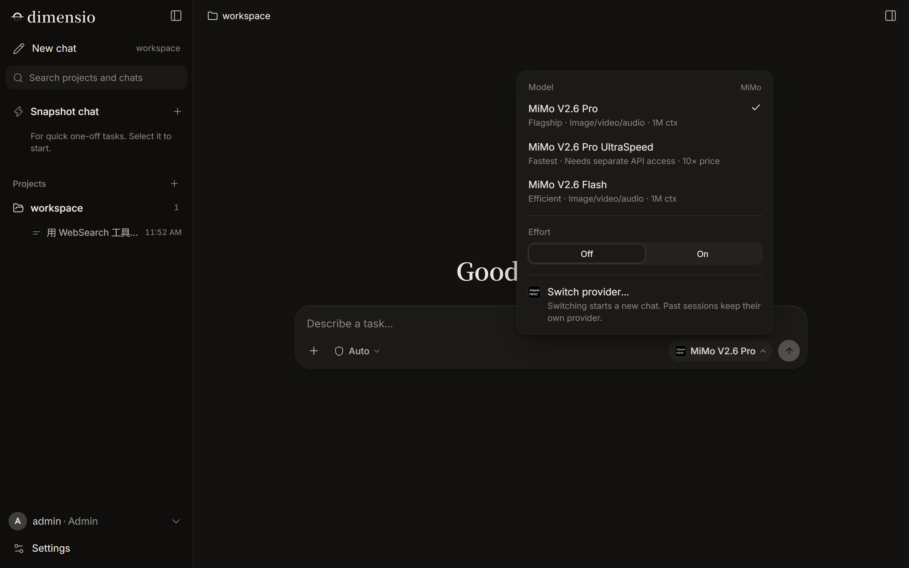

# Muse Bridge

**English** · [简体中文](README.zh-CN.md)

**One-message deployment of Claude Code on your [Muse](https://muse.ai) agent VM.** Once it's installed, open a URL in any browser, on your phone or your computer, and use Claude Code to write code, work with files and run commands. You can also install **dimensio**, an agent workspace that works with models from many providers: Anthropic, OpenAI, Gemini, DeepSeek, Kimi, Zhipu GLM, Qwen, Xiaomi MiMo and more.

Muse does the whole deployment for you. Send it one message and it downloads the release, asks you four questions, installs everything, registers a self-healing watchdog, then walks you through first use. You never touch a terminal.


## Highlights

- **Deploy with one message.** Paste the prompt below into Muse and it handles the rest, in about 5–10 minutes.
- **Works on phone and desktop.** The URL opens the full workspace. The interface is available in English and Simplified Chinese and follows your browser's language.
- **Android app.** Install it from **Settings → Android app**, or [download the APK](https://github.com/Wode44398/muse-bridge/releases/latest/download/MuseBridge.apk). It keeps your server address, and when a temporary URL changes you can switch to the new one right in the app. The interface is the same as the web version and updates with your server.
- **Full Claude Code.** Powered by the official Claude Agent SDK: tool use, subagents, workflows, context compaction and session resume. A side dock gives you a terminal, files, tasks and a diff review.
- **dimensio, a multi-model workspace.** One API key per provider, switch models at any time, or add any OpenAI-compatible endpoint. It has its own workspaces, memory and subagents.
- **Each provider's own web search.** Search uses the built-in search of whichever model the conversation is using, falls back to the next configured provider, and uses DuckDuckGo only as a last resort.
- **Survives VM restarts.** Muse restarts its VMs from time to time. A watchdog brings the service back within 60 seconds, and Muse tells you if the temporary URL changed.
- **Update prompts.** When a new version ships, Muse tells you what changed in a sentence or two and asks whether to update. It switches over only when nobody is chatting, and rolls back automatically if the new version fails to start.
- **Multi-user if you want it.** Invite codes let friends sign up. Every account gets its own directory, and you can decide per person which agents they can use and how much.

## Get started

Send this whole message to your Muse:

````text
I'd like you to install Muse Bridge on this VM, then show me how to use it. It's an open-source (MIT) project I picked: a browser-based workspace for Claude Code and other AI agents. Source and releases: https://github.com/Wode44398/muse-bridge (it's new, so web search may not find it yet; open the link directly). Please talk to me in English.

Step 1: download the latest release and verify its checksum. Outbound traffic on this VM goes through the hatch-egress-proxy proxy:

```bash
export HTTPS_PROXY=http://hatch-egress-proxy:3128 HTTP_PROXY=http://hatch-egress-proxy:3128
REL=/home/hatch/bridge-releases/$(date +%Y%m%d-%H%M%S) && mkdir -p "$REL" && chmod 755 /home/hatch/bridge-releases "$REL"
cd /tmp && curl -fLO --retry 3 https://github.com/Wode44398/muse-bridge/releases/latest/download/muse-bridge.tgz && curl -fLO --retry 3 https://github.com/Wode44398/muse-bridge/releases/latest/download/muse-bridge.tgz.sha256 \
  && sha256sum -c muse-bridge.tgz.sha256 && tar -xzf muse-bridge.tgz -C "$REL" && echo "extracted to $REL/bridge"
```

Step 2: read `$REL/bridge/deploy/muse/MUSE.md`. It's the install guide the project wrote for you (in Chinese; keep talking to me in English). Use it as your guide: ask me the four setup questions from section 1 in one message, then install, set up the watchdog hook, check the result, and walk me through first use. If anything in it looks wrong or unsafe to you, stop and ask me.

I approve each command you run, so please keep the number of commands small. The install script prints its own progress, so there's no need to poll it with tail, ps or sleep. Show me the real output of each step.
````

Muse downloads the release, reads the install guide, and asks you four questions at once:

1. **What to install:** Claude Code only, dimensio only, or both. If you pick one, the URL opens straight into that agent.
2. **Do you have your own domain** (on Cloudflare)? If not, you get a free temporary URL. It changes when the VM restarts, and Muse will tell you the new one. If you do, you can switch to a permanent address.
3. **Just you, or other people too?** Choose multi-user to hand out invite codes to friends.
4. **Send error reports automatically?** If yes, crashes and failed updates are reported to the developers on their own. Reports only contain the version, service status and where the program itself failed, never chats, files, keys or addresses.

Not sure? Pick Claude Code only, a temporary URL, and just you. You can change all of these later.

## What you need

- A Muse account.
- For Claude Code: a Claude Pro or Max subscription. Generate the token **on your own computer** with `claude setup-token` (Muse will guide you). Don't sign in to Claude on the Muse VM.
- For dimensio: an API key from at least one model provider.

## Models in dimensio



| Provider | Key name | Web search |
|---|---|---|
| Anthropic (Claude) | `ANTHROPIC_API_KEY` | ✓ built-in |
| DeepSeek | `DEEPSEEK_API_KEY` | ✓ built-in |
| Google Gemini | `GEMINI_API_KEY` | ✓ Google Search |
| Kimi (Kimi for Coding subscription, starts with `sk-kimi-`) | `KIMI_API_KEY` | ✓ built-in |
| Zhipu GLM | `ZHIPU_API_KEY` | ✓ built-in |
| Qwen | `QWEN_API_KEY` | ✓ built-in |
| Xiaomi MiMo (pay-as-you-go or Token Plan) | `MIMO_API_KEY` | see below |
| Any OpenAI-compatible endpoint | add it with "＋" in the UI | — |

Ask Muse to store a key for you (`set-api-key`), or paste it into dimensio's model panel yourself.

**Xiaomi MiMo web search** is a console plugin billed per call (about ¥16 per 1,000) and charged to your account balance, so it only works with a **pay-as-you-go** key. If you chat on a Token Plan subscription key (starts with `tp-`), create a pay-as-you-go key just for search with `set-api-key MIMO_SEARCH_API_KEY <sk-…>`; chat keeps using your Token Plan quota. Without it, MiMo conversations fall back to another provider's search.

## Android app

Open your Muse Bridge URL in your phone's browser, sign in, and go to **Settings → Android app → Download**. Once it's installed, come back to that page and tap **Open in app**: the app fills in the address for you. You can also [download the APK from GitHub](https://github.com/Wode44398/muse-bridge/releases/latest/download/MuseBridge.apk) and paste the address the first time you open it.

The app is a thin shell around the same web interface, so it never needs updating for new features. If the server is unreachable (for example, the temporary URL changed after a VM restart), the app shows a **Change address** button; ask Muse for the current URL and paste it in. If your phone blocks the install, allow your browser to install apps when it asks. There's no iPhone app; use Safari's **Share → Add to Home Screen** instead.

## FAQ

**Muse keeps asking whether it may share information with some website.**
The Muse VM needs your approval for every new website it contacts. During install, and whenever a key is added, Muse Bridge visits the sites it will need while you're there, so the approval cards show up at a moment you can answer them. Cards can appear above the message box or in the **Needs review** panel on the right. When one appears, pick the option that **always allows that site** (it's in the drop-down next to the one-time allow button) so it never asks again. If a conversation sits on "waiting for the model", there's usually an approval card nobody has answered.

**My URL changed after a few hours.**
Temporary URLs (`*.trycloudflare.com`) change when the VM restarts. Muse will tell you the new one. Your login token stays the same; you just sign in again at the new address. For an address that never changes, ask Muse to set up your own domain.

**How do I update?**
You don't have to do anything. Muse asks you when a new version is out; just say "update". You can also ask "is there a new version?" at any time, or have Muse turn on automatic updates.

**How do I use feature X?**
Just ask Muse ("how do I share a file?", "where are my old chats?", "walk me through dimensio"). The release ships a user guide written for Muse (`deploy/muse/guide/`), so it answers from the guide for your exact version instead of guessing, and it can give you a guided tour: a 5-minute quick start, Claude Code or dimensio in depth, admin and multi-user, or using it on your phone. Known issues are published through the update channel too, so Muse can tell you when something is a known problem and how to work around it.

**Something's broken. How do I tell you?**
Tell Muse, or open **Settings → Feedback → Report** (an error message also gets a **Report a problem** button). One sentence is enough and you don't need a GitHub account: it's filed as an issue here, with the version, service status and the program's own error details attached. Chats, files, keys and addresses are never included, and you can see the report before it's sent. If someone already reported the same problem, your report becomes a +1 on theirs, and Muse tells you when a release fixes it. Security problems go privately to the maintainers.

**What does it cost?**
Muse Bridge itself is free and open source. Claude Code runs on your own Claude subscription, and dimensio runs on your own API keys, billed by each provider.

## Limitations

- The Muse VM can't run a browser sandbox, so agents have no browser tools such as opening pages or taking screenshots. Web search and fetching page content still work.
- This runs on Muse's VM, not a production server. The platform can change its network at any time, and serving the public long-term may break its terms. Don't keep important data here or treat it as production.

## Installing on a regular Linux server

Muse isn't required. On Debian / Ubuntu with systemd:

```bash
git clone https://github.com/Wode44398/muse-bridge.git /opt/muse-bridge && cd /opt/muse-bridge
sudo bash scripts/server/install.sh --agents claude,dimensio
```

Run `install.sh --help` to see all options. The service listens on 127.0.0.1 only; for outside access, set up your own tunnel or reverse proxy (`--tunnel-token` can start a Cloudflare named tunnel for you). To update: `sudo bash scripts/server/update.sh`.

## Repository layout

| Path | Contents |
|---|---|
| `src/` | Server (Node 24, no build step) |
| `web/` | Frontend (Vite + Svelte 5) |
| `harness/` | dimensio (TypeScript, run natively by Node) |
| `android/` | Android app (a WebView shell, no dependencies; built by the release workflow) |
| `scripts/server/` | Generic Linux install / update scripts |
| `deploy/muse/` | Muse-specific: the `bootstrap.sh` installer, `MUSE.md` (the instructions Muse follows), `guide/` (the user guide Muse answers from), `known-issues.json` and ops templates |
| `feedback-worker/` | The Cloudflare Worker that turns user-approved problem reports into GitHub issues (holds the GitHub App key; installs never do) |

## Releasing (maintainers)

Push a `v*` tag. An annotated tag is best, because its message is shown to users as the release notes:

```bash
git tag -a v0.2.0 -m "What changed, in a sentence or two for users"
git push origin v0.2.0
```

GitHub Actions (`.github/workflows/release.yml`) builds the Android app (`MuseBridge.apk`, attached to the Release and bundled in the package under `downloads/`), builds `muse-bridge.tgz`, generates the `.sha256` and the `latest.json` update channel, and creates the Release. Installed Muse VMs read `latest.json` every 6 hours and ask their user about new versions. Betas (e.g. `v0.2.0-beta.1`) are pushed to users too; only tags containing `-test` (e.g. `v0.2.0-test.1`) become pre-releases, which stay out of the update channel and are meant for maintainers to trial on a fresh Muse.

The APK is signed with the key in the repository's Actions secrets (`ANDROID_KEYSTORE_BASE64`, `ANDROID_KEYSTORE_PASSWORD`, `ANDROID_KEY_ALIAS`, `ANDROID_KEY_PASSWORD`). Without them (in a fork, say) the workflow falls back to a debug signature: the APK still installs, but it can't update over an officially released one.

The workflow refuses to release if the user guide (`deploy/muse/guide/`) no longer matches the UI (`deploy/muse/test/guide.test.mjs`). Before tagging, also run the guide Q&A check once (`node deploy/muse/test/guide-qa/run.mjs`, uses your local `claude` CLI). Known issues live in `deploy/muse/known-issues.json`: each release publishes them in `latest.json`, and pushing a change to that file on `main` updates the latest release's `latest.json` without a new release (`.github/workflows/known-issues.yml`), so installs already out there learn about a problem and its workaround within 6 hours.

## License

[MIT](LICENSE). Use of Claude Code and the Claude Agent SDK is subject to Anthropic's terms; when deploying on Muse, follow Muse's platform terms as well.
